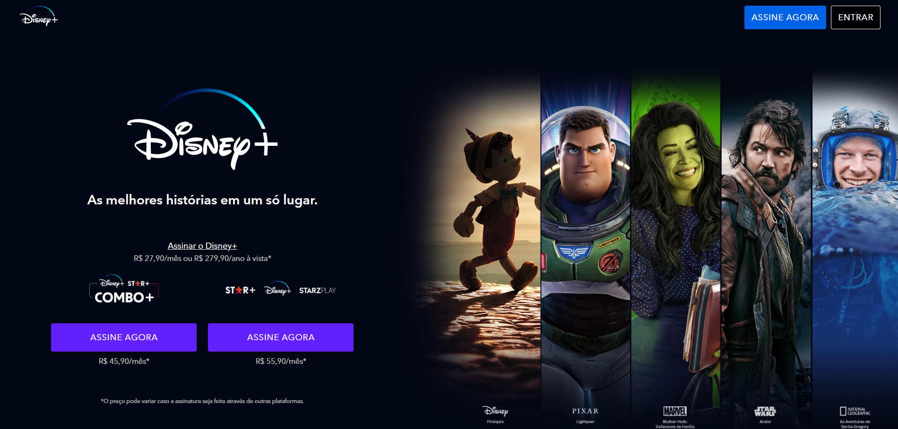

# 🌟 Landing Page Disney

Landing page inspirada no universo mágico da Disney, desenvolvida com foco em boas práticas de front-end moderno.

---

## 📌 Sobre o Projeto

Este projeto tem como objetivo praticar e demonstrar conhecimentos em:

- Estrutura semântica com HTML5  
- Estilização modular com SCSS  
- Metodologia BEM para organização de classes CSS  
- Automação com Gulp  
- Responsividade com media queries  
- Reutilização com mixins SCSS  

---

## 🚀 Tecnologias Utilizadas

- **HTML5**
- **SCSS (Sass)**
- **BEM (Block Element Modifier)**
- **Gulp**
- **Media Queries**
- **Mixins personalizados**

---

## ⚙️ Como rodar o projeto localmente

1. Clone o repositório:

```bash
git clone https://github.com/jawc-05/landing_page_disney-
```

2. Acesse a pasta do projeto:

```bash
cd landing_page_disney-
```

3. Instale as dependências:

```bash
npm install
```

4. Execute o Gulp para compilar os arquivos SCSS e ativar o modo de desenvolvimento:

```bash
gulp
```

---

## 📱 Responsividade

A página é totalmente responsiva, com ajustes realizados por meio de media queries no SCSS e mixins personalizados para evitar repetição de código.

---

## 🧠 Metodologia BEM

As classes CSS seguem o padrão `Block__Element--Modifier`, garantindo maior clareza e manutenção do código.

Exemplo real do projeto:
```html
<section class="shows">
  <ul class="shows__list">
    <li class="shows__list__item">...</li>
  </ul>
</section>
```

---

## 📸 Captura de Tela




---

## 🪪 Licença

Este projeto está licenciado sob a [Licença MIT](LICENSE).


---

## ✨ Autor

Desenvolvido por [jawc-05](https://github.com/jawc-05)
